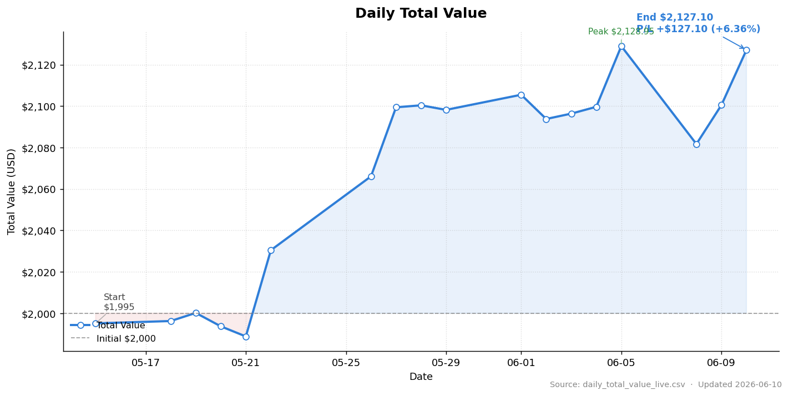

# Leveraged ETF Hedging Strategy
**杠杆 ETF 对冲套利策略**

Dynamically rebalances between paired bull/bear leveraged ETFs. Includes drawdown-triggered response mechanism and profit reset.

在标的的牛/熊杠杆 ETF 之间动态调仓。内置回撤应对机制和止盈重置。

## 收益曲线 / Equity Curve

> 数据源：[`data/daily_total_value.csv`](data/daily_total_value.csv)　·　重新生成图表：`python3 scripts/plot_equity_curve.py`

---

## Stack / 技术栈
- Alpaca Markets (paper + live) · WebSocket + REST
- Python · Daily-bar backtest sharing live signal logic
- Multi-strategy orchestration on a single API client

## Status / 状态
- ✅ Backtest / 回测
- ✅ Live via WebSocket (paper-tested) / 实盘 (纸面验证)
- ✅ Monitoring dashboard / 监控面板
<!-- 🚧 -->
## Caveats / 风险提示
- ⚠️ Leveraged ETFs · hedged ≠ risk-free · backtest ≠ future · educational use only
- ⚠️ 杠杆 ETF · 对冲非无风险 · 回测非未来 · 仅供学习

## Disclaimer / 免责声明
For research and education only. Not investment advice. No warranty.
Use at your own risk.

仅供研究学习，不构成投资建议。使用者自行承担一切风险。

All Rights Reserved

## 数据格式

`data/daily_total_value.csv` 字段如下：

| 字段 | 含义 | 说明 |
|---|---|---|
| `date` | 交易日 | 格式 `YYYY-MM-DD`，仅记录实际交易日，不补节假日 |
| `total_value` | 当日盘后总市值 | 从本地 Excel 的 `total_value` 列读取最后一个非空值 |
| `daily_return` | 当日收益率 | 相对前一交易日的简单收益率，首日为 0 |
| `initial_value` | 起始本金 | 全表恒定，第一次运行脚本时写入后不再变 |
| `P/L` | 累计盈亏（金额） | `total_value − initial_value` |
| `MaxDrawDown` | 截至当日的历史最大回撤 | 负数，例如 `-0.0832` 代表 −8.32% |
| `SharpeRatio` | 截至当日的年化夏普比率 | 样本不足 20 个交易日时留空 |

## 指标计算口径

**daily_return**

$$r_t = \frac{V_t - V_{t-1}}{V_{t-1}}$$

其中 $V_t$ 为第 $t$ 个交易日的 `total_value`。首日 $r_0 = 0$。

**P/L**

$$\text{P/L}_t = V_t - V_{\text{initial}}$$

简单的金额差。注意：此口径假设期间**没有入金/出金**。如果中途追加或赎回本金，需改用时间加权收益率（TWR），届时再调整脚本。

**MaxDrawDown**

$$\text{MDD}_t = \min_{s \le t} \frac{V_s - \max_{u \le s} V_u}{\max_{u \le s} V_u}$$

即截至 $t$ 日，历史净值相对其历史峰值的最大跌幅。用负数表示，越接近 0 越好。每天会基于完整历史重算。

> ⚠️ **口径切换说明**：自 `scripts/update_daily_total_value.py` 接管增量更新（2026-05 起），新追加的 `MaxDrawDown` 直接取自 `daily_summary_multi.csv` 的 `drawdown_pct`（÷ 100），由 trading bot 用动态维护的 `portfolio_peak` 计算。该值与上式公式（峰值取 `total_value` 的全历史 max）在 `total_value` 曾突破 `initial_value` 时会有差异——脚本接管前的历史行峰值约等于 `initial_value`，可能比新行口径偏小。

**SharpeRatio**

$$\text{Sharpe}_t = \frac{\overline{r - r_f}}{\sigma_{r - r_f}} \cdot \sqrt{252}$$

其中 $r_f$ 为日度无风险利率，由年化值 `RF_ANNUAL` 按几何方式换算：$r_f = (1 + \text{RF\_ANNUAL})^{1/252} - 1$。样本为开仓至 $t$ 日的全部 `daily_return`。年化系数 252（按 A 股/美股交易日数；加密货币改 365）。**样本少于 20 个交易日时留空**，因为统计意义不足。

> 当前 `scripts/update_daily_total_value.py` **暂未实现 Sharpe 计算**，新追加行的 `SharpeRatio` 列保持空。等满足 20 日样本阈值后再实现。

### 默认参数

| 参数 | 默认值 | 在脚本中的位置 |
|---|---|---|
| 起始本金 | `2000.00` | `INITIAL_VALUE` |
| 年化无风险利率 | `0.0368` | `RF_ANNUAL` |
| 年化交易日数 | `252` | `TRADING_DAYS` |
| 夏普最小样本 | `20` | `MIN_DAYS_FOR_SHARPE` |

> `RF_ANNUAL = 0.0368` 取自美国 3 个月国债收益率（2026-05-01，3.68%），是 Sharpe 比率最常用的无风险利率基准。建议每季度（或随利率显著变化时）从 [FRED DGS3MO](https://fred.stlouisfed.org/series/DGS3MO) 或 [U.S. Treasury Daily Rates](https://home.treasury.gov/resource-center/data-chart-center/interest-rates) 同步一次。
